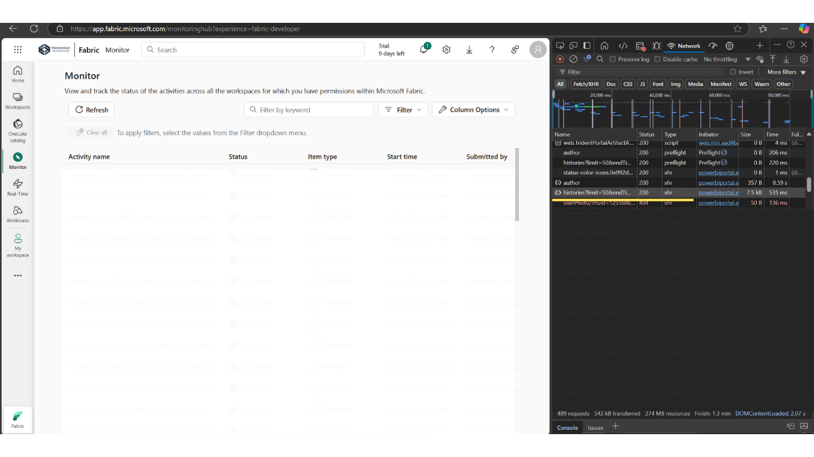

# MicrosoftFabricMonitoringHubAPIHack
Hidden insights from Microsoft Fabric with this unofficial Monitoring Hub API hack! This Python script uses Pandas to fetch, clean, and analyze job history data from an undocumented endpoint. Track run times, outcomes, and ownership with ease.

Fabric Monitoring Hub API Hack
Microsoft Fabric Doesn’t Show You This - But It Should! 😉
Overview
In any data platform, especially something as integrated as Microsoft Fabric, it's super important to know what’s running in the background—whether it's a Synapse Notebook, Data Factory Pipeline, Lakehouse job, or something else. You need to see when a job ran, who triggered it, how long it took, whether it succeeded or failed, and if it failed, why.
The problem is, Fabric doesn’t yet offer a clear, built-in way to explore this. The data exists in the Monitoring Hub, but it’s not developer/user-friendly to access or analyze, especially if you want to spot failures, track durations, or understand usage patterns over time.
This project provides a simple solution using Python and Pandas. It connects to the unofficial Monitoring Hub API, pulls job history, cleans it up, and adds useful insights like job durations, outcomes, and ownership. Now you have a clear view of everything that ran, and it’s actually super nice!
Disclaimer
This is not an official API from Microsoft. The API request URL was discovered using browser developer tools (Inspect Element → Network tab). Use at your own risk, as Microsoft may change or disable this endpoint without notice.
Prerequisites

A Microsoft Fabric account with access to the Monitoring Hub.
A valid authentication token (e.g., retrieved via Azure AD or Fabric notebook environment).

Discover the Monitoring Hub API URL:

Open Microsoft Fabric in your browser.
Go to the Monitoring Hub.
Open Developer Tools (Ctrl+Shift+I), go to the Network tab, and look for requests to .../metadata/monitoringhub/histories.
Copy the full URL and replace the placeholder.

Update the token retrieval in monitor_fabric_jobs.py:

Replace the get_fabric_token() function with your actual token retrieval method (e.g., using Azure AD or Fabric's notebookutils if running in a notebook).

Contributing
Feel free to fork this repository, make improvements, and submit pull requests. If you have better ways to monitor Fabric workloads, let me know!

